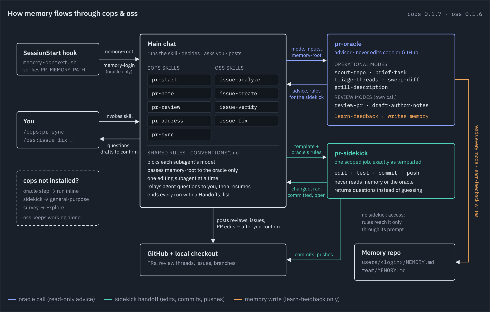

# ai-skills

AI skills kit — a plugin marketplace for Claude Code and Cursor.

## Plugins

- [`oss/`](oss/) — maintaining and contributing to open source projects: sizing, filing, verifying, and fixing issues. Claude Code: `/oss:<skill-name>`, e.g. `/oss:issue-verify`. Cursor: `/issue-verify`.
- [`cops/`](cops/) **Code Ops** — working with pull requests: starting a draft PR from a task, reviewing, addressing comments, syncing. Claude Code: `/cops:<skill-name>`, e.g. `/cops:pr-start` or `/cops:pr-sync`. Cursor: `/pr-sync`.

`cops` also ships two agents, used by both plugins' skills (`cops:pr-oracle` / `cops:pr-sidekick` in Claude Code, subagents in Cursor):

- [`pr-oracle`](cops/agents/pr-oracle.md) — remembers recurring review themes, profiles repository setup, and drafts complete PR reviews and author notes.
- [`pr-sidekick`](cops/agents/pr-sidekick.md) — runs the implement/test/commit loops skills hand off, applying the remembered rules the oracle picks for each job.

`oss` works on its own; install `cops` too to add the memory and agents ([`CONVENTIONS-orchestration.md`](CONVENTIONS-orchestration.md#companion-plugin-cops)).



## Layout

- Catalogs: [`.claude-plugin/marketplace.json`](.claude-plugin/marketplace.json) (Claude Code), [`.cursor-plugin/marketplace.json`](.cursor-plugin/marketplace.json) (Cursor).
- Each plugin: `.claude-plugin/plugin.json` and `.cursor-plugin/plugin.json` manifests; skills in `skills/<skill-name>/SKILL.md`.
- [`CONVENTIONS.md`](CONVENTIONS.md) and its four indexed reference files hold rules shared by more than one skill (e.g. the `[package-name]` monorepo title prefix), so skills point to them instead of restating them. Rules marked *Default* can be overridden by a repo's `CLAUDE.md`, the oracle's memory, or the current conversation; the rest are contracts. An installed plugin only gets its own directory, so `oss/` and `cops/` each carry identical copies of all five files — edit the root set, then copy it over both.

## Development

Run the repository checks (requires Bash, `jq`, and Perl):

```bash
bash scripts/validate.sh
```

To render the diagram, install the locked dependencies first:

```bash
pnpm install
```

### Updating the diagram

The diagram above is [`docs/memory-flow.png`](docs/memory-flow.png), rendered from [`docs/memory-flow.html`](docs/memory-flow.html) by `pnpm render:memory-flow` (needs `jq` and pnpm). The script stamps plugin versions from the manifests, so a version bump only needs a re-run. When skills, agents, or memory access change, give an agent this prompt:

```text
Update docs/memory-flow.html so the diagram matches the current code. Read
cops/agents/*.md, cops/hooks/memory-context.sh, CONVENTIONS-orchestration.md,
cops/skills/*/SKILL.md, oss/skills/*/SKILL.md and
cops/references/pr-oracle/modes/*.md. Show only the access paths the code
allows, and label every arrow with what passes along it. Keep the layout,
colors, legend, and the COPS skills in PR lifecycle order (pr-start,
pr-note, pr-review, pr-address, pr-sync). Run `pnpm render:memory-flow`, look at
docs/memory-flow.png, then commit and push.
```

## Install

After installing `cops`, follow its [Setup](cops/README.md#setup): connect the GitHub MCP server for the oracle, and optionally attach a memory repository to the workspace.

### Claude Code

Add the marketplace, then install the plugin(s) you want:

```
/plugin marketplace add eddeee888/ai-skills
/plugin install oss
/plugin install cops
```

Local checkout for development:

```
claude --plugin-dir ./oss
claude --plugin-dir ./cops
```

### Cursor

**Anyone / yourself:** add the GitHub catalog, then install `oss` and/or `cops` from Customize or the CLI `/plugin` Marketplace tab:

```
cursor-agent plugin marketplace add https://github.com/eddeee888/ai-skills
```

**Team / Enterprise:** [Dashboard → Plugins → Add Marketplace → Import from Repo](https://cursor.com/docs/plugins), paste `https://github.com/eddeee888/ai-skills`, review `oss` and `cops`, set access and Default Off / On / Required. Optionally enable Auto Refresh (needs the [Cursor GitHub App](https://cursor.com/docs/integrations/github.md) on this repo).

**Official public listing (optional):** submit this repo at [cursor.com/marketplace/publish](https://cursor.com/marketplace/publish). Manual review; the repo must stay public and open source.

Local checkout for development: copy `oss` and `cops` into `~/.cursor/plugins/local/` (do not symlink from outside that folder) and reload the window.
